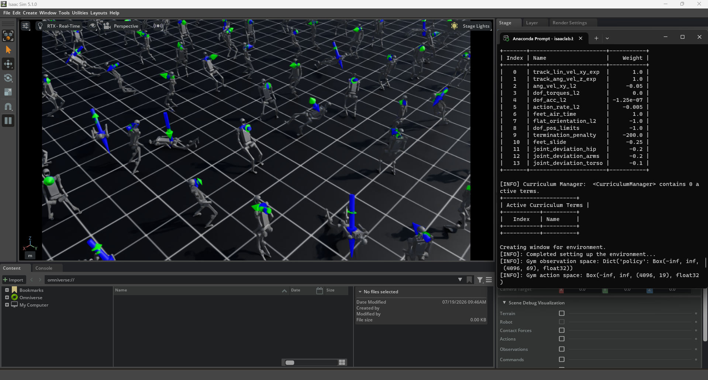
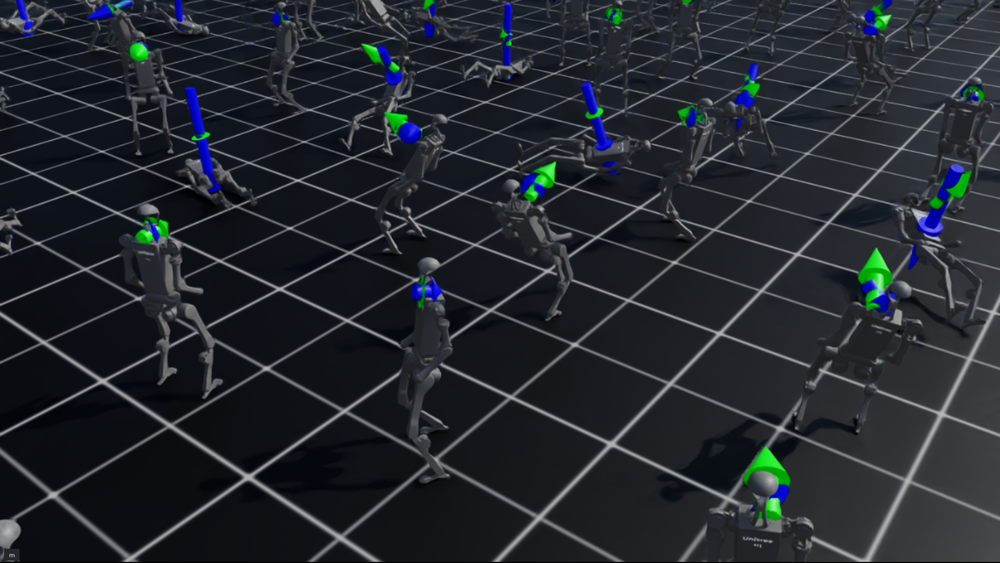

# Isaac Lab Environment Setup

## Objective

This milestone establishes the simulation foundation for humanoid intelligence research.

The goal is to configure NVIDIA Isaac Sim and Isaac Lab, validate the reinforcement learning pipeline, and successfully deploy the Unitree H1 humanoid robot for future humanoid learning experiments.

---

## Software Environment

- Simulator: NVIDIA Isaac Sim 5.1
- Robotics Framework: NVIDIA Isaac Lab
- Robot Platform: Unitree H1 Humanoid Robot
- Reinforcement Learning Framework: RSL-RL
- Learning Algorithm: Proximal Policy Optimization (PPO)

---

## Completed Tasks

### Isaac Lab Validation

The following components were successfully validated:

- Isaac Sim installation
- Isaac Lab environment
- GPU accelerated simulation
- Reinforcement learning pipeline
- Parallel environment execution


### Robot Validation

Successfully loaded:

```
Unitree H1 Humanoid Robot
```

Environment:

```
Isaac-Velocity-Flat-H1-v0
```

---

## Tested Environments

### Ant Reinforcement Learning Test

Command:

```bash
isaaclab.bat -p scripts/reinforcement_learning/rsl_rl/train.py --task=Isaac-Ant-v0
```

Purpose:

Validate the basic reinforcement learning pipeline in Isaac Lab.


---

### ANYmal Rough Terrain Test

Command:

```bash
isaaclab.bat -p scripts/reinforcement_learning/rsl_rl/train.py --task=Isaac-Velocity-Rough-Anymal-C-v0
```

Purpose:

Validate terrain-based locomotion learning.


---

### Unitree H1 Humanoid Test

Command:

```bash
isaaclab.bat -p scripts/environments/random_agent.py --task Isaac-Velocity-Flat-H1-v0
```

Purpose:

Validate humanoid simulation environment and H1 robot loading.

---

## Current Result

The Isaac Lab humanoid simulation environment was successfully initialized.

The Unitree H1 robot can be loaded and simulated, providing the foundation for:

- Humanoid locomotion learning
- Human motion representation learning
- Latent objective discovery
- Objective-conditioned reinforcement learning

---

## Research Pipeline

Current progress:

```
Isaac Lab Setup
        |
        v
H1 Locomotion Baseline
        |
        v
Human Motion Representation
        |
        v
Latent Objective Learning
        |
        v
Generalizable Humanoid Intelligence
```

---

## Next Milestone

The next step is training a humanoid locomotion baseline using reinforcement learning.

Goals:

- Train Unitree H1 walking policy
- Evaluate learning performance
- Record simulation results
- Establish baseline for future objective-driven learning methods
- ---

---

## Demo Video

The following video demonstrates the successful setup of NVIDIA Isaac Sim and Isaac Lab with the Unitree H1 humanoid robot.

▶️ **Milestone 1 Demo: Isaac Lab Setup and Unitree H1 Simulation**

[Watch the demonstration video on YouTube](https://youtu.be/vSZAUeN6fe8)

---

## Simulation Screenshots

### Isaac Sim Environment



### Unitree H1 Multi-Environment Simulation



---
