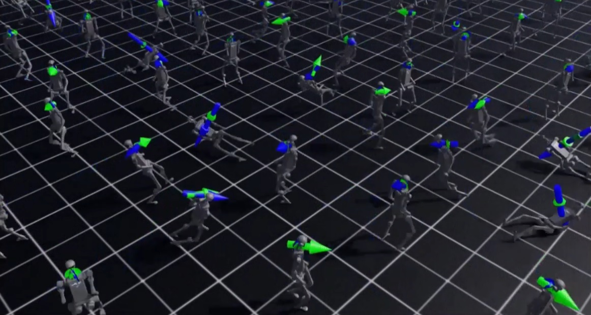
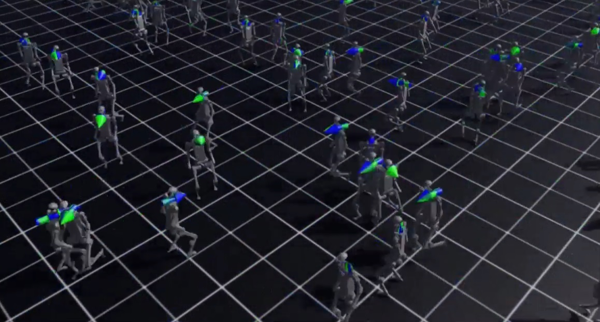
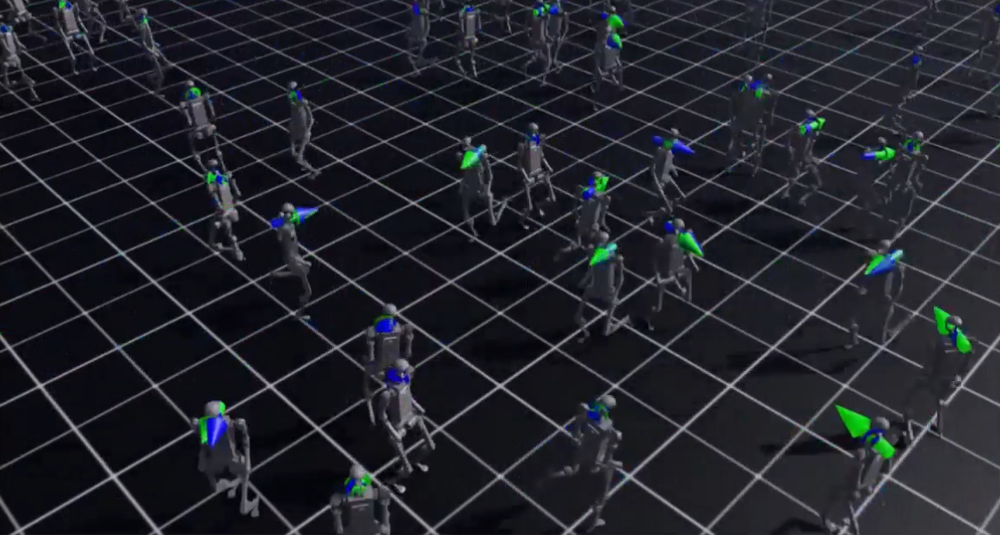

# Milestone 2: Unitree H1 Humanoid Locomotion Training

## Overview

This milestone establishes a reinforcement learning baseline for humanoid locomotion using the Unitree H1 humanoid robot in NVIDIA Isaac Lab.

The purpose of this experiment is to train a humanoid robot to learn stable walking behavior from interaction with a physics-based simulation environment.

This baseline serves as the foundation for the future research direction:

**Learning Latent Human Objectives as Differentiable Physical Cost Functions for Generalizable Humanoid Intelligence**

The trained locomotion policy will later be extended toward:

- Human motion representation learning
- Latent objective discovery
- Physics-aware learning
- Objective-conditioned reinforcement learning
- Generalizable humanoid intelligence


---

# Simulation Environment

## Robot

Unitree H1 Humanoid Robot


## Simulator

NVIDIA Isaac Sim 5.1


## Robotics Framework

NVIDIA Isaac Lab


## Reinforcement Learning Framework

RSL-RL


## Learning Algorithm

Proximal Policy Optimization (PPO)


---

# Training Configuration

## Environment

```
Isaac-Velocity-Flat-H1-v0
```


## Training Method

```
PPO Reinforcement Learning
```


## Training Duration

```
5000 Iterations
```


## Simulation Experience

```
450M+ Simulation Steps
```


The training process starts from an untrained policy where the robot exhibits unstable movements and falling behaviors.

Through reinforcement learning, the policy gradually improves balance control, velocity tracking, and locomotion stability.


---

# Training Demonstration

## Complete Learning Process Video

The complete training progression from initial random motion to stable locomotion is available below:

[Watch Milestone 2: Unitree H1 Humanoid Locomotion Training](https://youtu.be/6YOVntG1ACI)


The video demonstrates:

- Initial unstable movements
- Falling behaviors during early learning
- Progressive locomotion improvement
- Final learned walking behavior


---

# Training Progress


## Initial Stage

At the beginning of training, the humanoid robot has no learned locomotion strategy.

Observed behaviors:

- Random joint movements
- Frequent falling
- Loss of balance
- Poor velocity tracking





---

## Intermediate Stage

During reinforcement learning, PPO improves the locomotion policy through continuous interaction with the simulation environment.

The robot gradually learns:

- Balance stabilization
- Coordinated leg movements
- Improved body control
- More consistent walking patterns





---

## Final Stage

After 5000 PPO iterations, the Unitree H1 develops a stable locomotion policy.

The robot is able to:

- Maintain balance
- Generate continuous walking motion
- Track desired velocity commands





---

# Training Outputs

Isaac Lab automatically saves PPO checkpoints during training.


Example output structure:

```
logs/
└── rsl_rl/
    └── h1_flat/
        └── training_run/
            ├── model_0.pt
            ├── model_1000.pt
            ├── model_2500.pt
            └── model_4999.pt
```


Final trained policy:

```
model_4999.pt
```


The checkpoint can be used for:

- Policy evaluation
- Resume training
- Transfer learning experiments
- Future humanoid learning research


---

# Results Summary

This milestone successfully demonstrates:


✓ Isaac Lab humanoid simulation setup

✓ Unitree H1 robot integration

✓ PPO-based humanoid locomotion learning

✓ Large-scale parallel reinforcement learning simulation

✓ Successful policy checkpoint generation

✓ Learning progression from falling behavior to stable walking


---

# Observation and Limitations

Although the trained policy achieves stable locomotion, the learned walking behavior is not fully human-like.

The current PPO baseline optimizes predefined physical reward functions and does not explicitly understand the hidden objectives behind human walking.

Remaining challenges include:

- Human walking objectives
- Natural motion preferences
- Energy-efficient locomotion strategies
- Robust adaptation principles


These limitations motivate the next research milestones focused on discovering latent human objectives from motion data.


---

# Commands

Training, evaluation, and resume commands are available in:

[commands.md](commands.md)


---

# Future Research Direction

The next milestones will investigate:


## Milestone 3

Human Motion Representation Learning


## Milestone 4

Latent Human Objective Discovery


## Milestone 5

Objective-Conditioned Reinforcement Learning


## Milestone 6

Generalizable Humanoid Intelligence


---

# Main Repository

[Latent Objective Humanoid Intelligence Research Repository](https://github.com/majid-khorramgah/latent-objective-humanoid)
