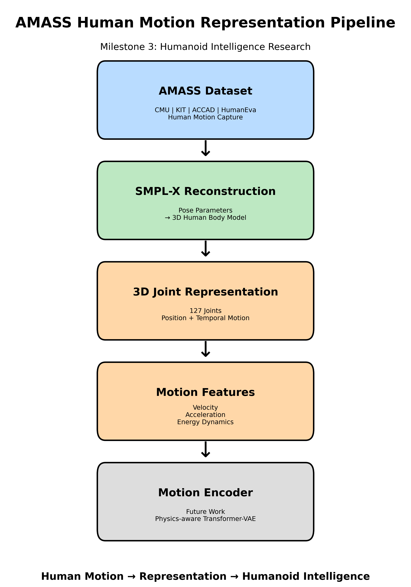
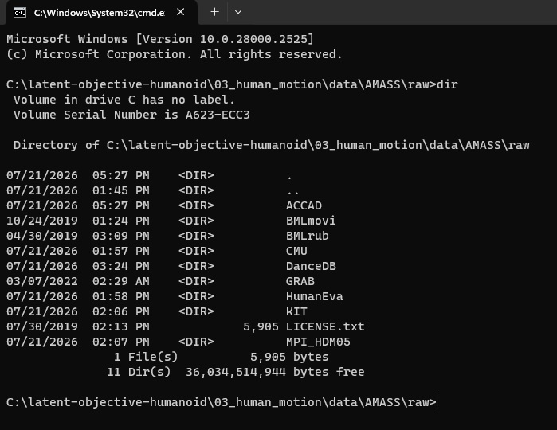
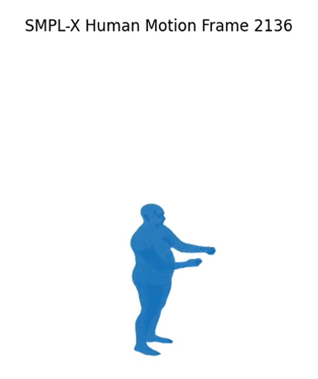
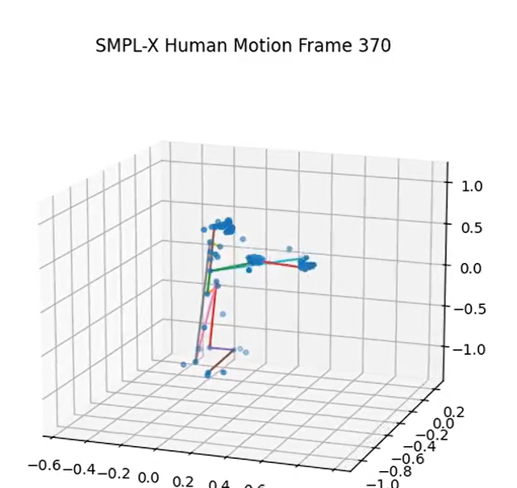
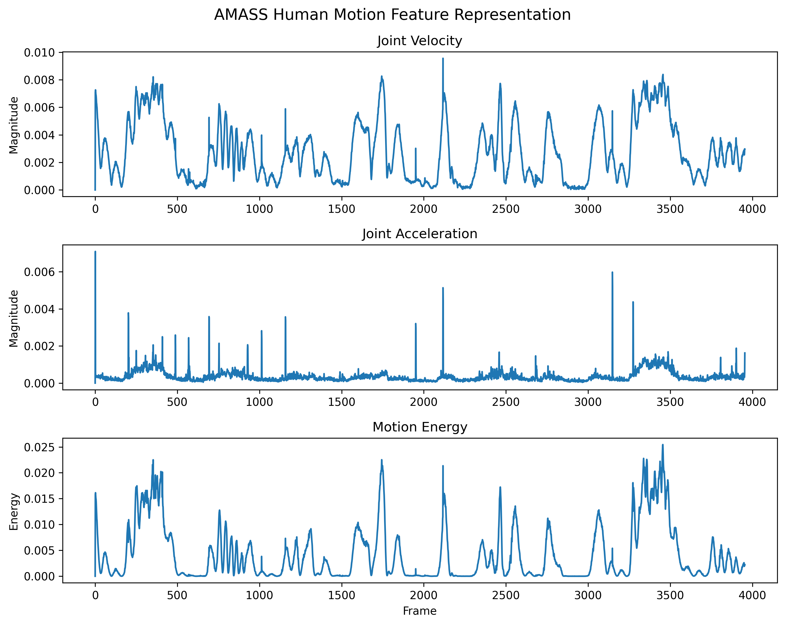

# Milestone 3: AMASS Human Motion Representation Pipeline for Humanoid Intelligence


## Overview

This milestone develops a complete human motion representation pipeline using the **AMASS human motion dataset** and the **SMPL-X parametric human body model**.

The objective of this stage is to transform raw human motion capture sequences into structured physical representations suitable for future humanoid learning systems.

Instead of directly learning from raw motion trajectories, this pipeline extracts meaningful representations including:

- 3D human body reconstruction
- Joint-based motion representation
- Temporal motion dynamics
- Kinematic features

These representations provide the foundation for future **Motion Encoder**, **latent objective discovery**, and **humanoid intelligence learning**.


---

# Pipeline Overview





The complete pipeline:

```
AMASS Motion Capture Dataset

            ↓

SMPL-X Human Body Reconstruction

            ↓

3D Joint Representation

            ↓

Motion Feature Extraction

            ↓

Motion Encoder (Future Work)
```


---

# Dataset


This pipeline processes motion capture sequences from the AMASS dataset.

Currently included datasets:


```
AMASS/

├── ACCAD
├── BMLmovi
├── BMLrub
├── CMU
├── DanceDB
├── GRAB
├── HumanEva
├── KIT
└── MPI_HDM05
```


Each AMASS motion file contains:


- Pose parameters
- Body shape parameters (betas)
- Motion capture frequency
- Global body information


Example:


```
poses:

(3955,156)


betas:

(16,)


mocap_framerate:

120 Hz
```


Input example:





---

# SMPL-X Human Body Reconstruction


The AMASS pose parameters are converted into a full 3D human representation using the SMPL-X body model.


The SMPL-X forward process generates:

- Human body mesh
- Anatomical joints
- 3D kinematic structure


Example reconstruction:





Generated output:


```
Vertices:

(3955,10475,3)


Joints:

(3955,127,3)
```


This validates that human motion capture data can be reconstructed into a physically meaningful 3D human representation.


---

# 3D Joint Motion Representation


After SMPL-X reconstruction, human motion is represented using 3D joint trajectories.





The extracted representation contains:


```
127 Human Joints


Position:

(x,y,z)


Temporal Dynamics:

Frame-to-frame motion
```


This representation is more suitable for learning algorithms compared with raw pose parameters because it explicitly describes human kinematics.


---

# Motion Feature Extraction


Temporal motion features are extracted from the reconstructed joint sequences.


Generated features:


```
joints

velocity

acceleration

energy
```


Feature visualization:





## Joint Velocity

Measures the movement of each joint over time.


## Joint Acceleration

Captures changes in motion dynamics.


## Motion Energy

Represents the overall intensity of human movement.


These features provide a compact physical description of human motion dynamics for future representation learning.


---

# Project Structure


```
03_human_motion/

│
├── README.md
│
├── data/
│   └── AMASS/
│       └── raw/
│
│
├── external/
│   └── smplx/
│       └── models/
│
│
├── scripts/
│
│   ├── 01_load_amass.py
│   ├── 02_extract_pose.py
│   ├── 03_smpl_forward.py
│   ├── 04_export_motion.py
│   ├── 05_visualize_motion.py
│   ├── 06_visualize_joints.py
│   ├── 07_extract_motion_features.py
│   ├── 08_visualize_features.py
│   └── 09_create_pipeline_overview.py
│
│
├── results/
│
│   └── features/
│
│
└── media/
    └── screenshots/

```


---

# Generated Feature Representation


Example output:


```
results/features/CMU/

└── 31_01_features.npz
```


The generated file contains:


```
joints:

(3955,127,3)


velocity:

(3955,127,3)


acceleration:

(3955,127,3)


energy:

(3955,)
```


These features will be used as input representation for future motion learning models.

# Future Work


## Milestone 4: Human Motion Encoder


The next stage focuses on learning compact motion representations from the extracted human motion features.


Planned architecture:


```
3D Joint Motion Sequence

            ↓

Motion Encoder

            ↓

Latent Motion Representation
```


Potential approaches:

- Transformer-based Motion Encoder
- Variational Autoencoder (VAE)
- Physics-aware representation learning


---

# Milestone 5: Latent Human Objective Discovery


The goal is to discover hidden objectives behind human movement.

Possible latent objectives:

- Stability
- Energy efficiency
- Task success
- Robustness
- Adaptation


Human motion will be interpreted as the result of underlying optimization processes rather than simple trajectory imitation.


---

# Milestone 6: Objective-conditioned Humanoid Learning


The final objective is to transfer learned human motion knowledge into humanoid robots.


```
Human Motion

        ↓

Latent Objectives

        ↓

Humanoid Policy Learning

        ↓

Adaptive Robot Behavior
```


---

# Summary


This milestone establishes the connection between large-scale human motion data and humanoid intelligence.

The developed pipeline converts raw AMASS motion capture sequences into structured physical representations using SMPL-X and kinematic feature extraction.

These representations provide the foundation for future research on:

- Human motion understanding
- Motion representation learning
- Latent objective discovery
- Generalizable humanoid intelligence
