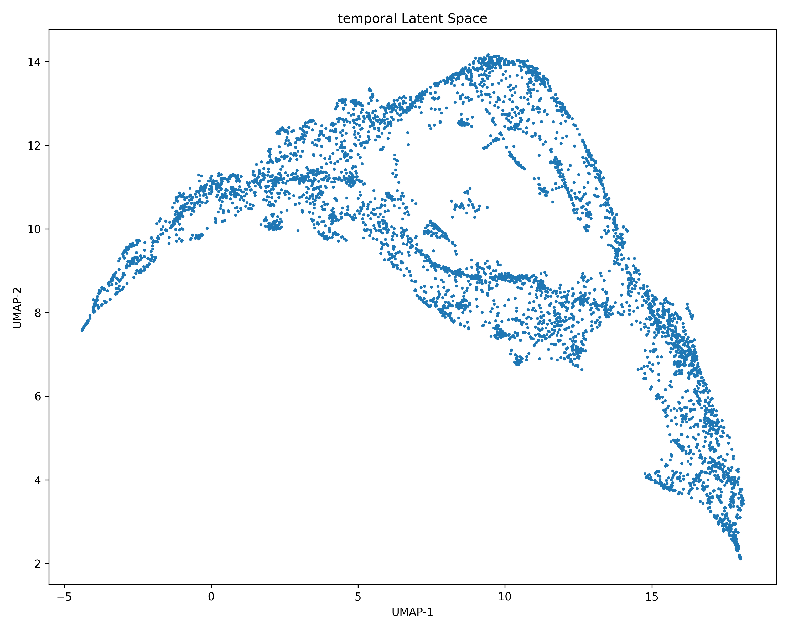
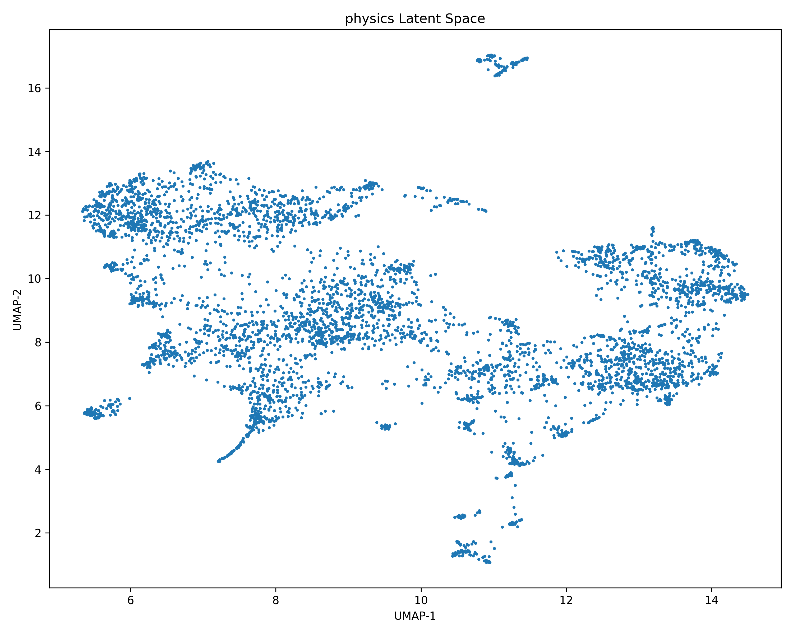
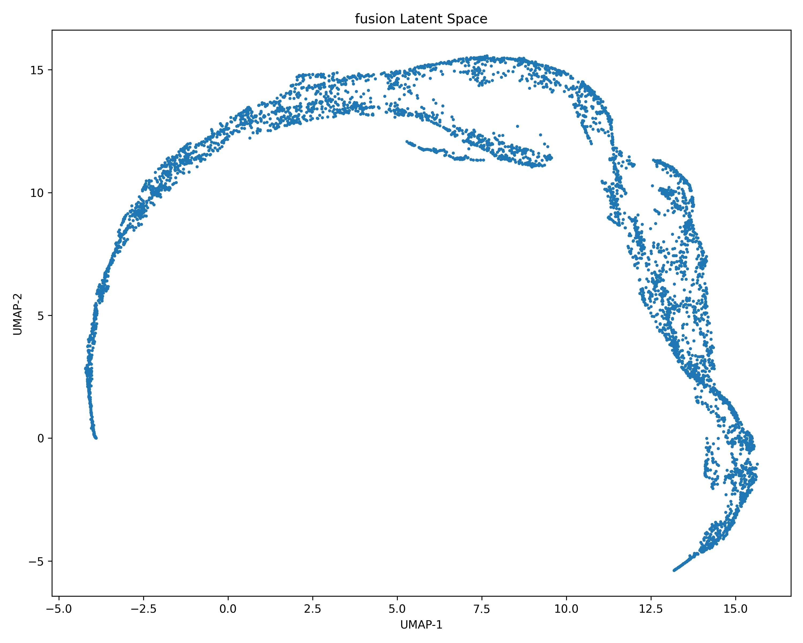

# 03 - Latent Representation Evaluation

## Overview

This module evaluates the quality and structure of the latent representations learned by the **Multi-Branch Motion Foundation Encoder**.

The goal of this stage is to answer a fundamental research question:

> Does the foundation encoder learn meaningful human motion representations beyond simple reconstruction?

The evaluation focuses on whether the learned latent space captures:

- Temporal motion patterns
- Physics-aware movement characteristics
- High-level human motion semantics
- Generalizable motion structures

---

# Research Pipeline

The complete framework follows:

```
01 Data Preparation
        |
        v
02 Foundation Encoder
        |
        v
03 Latent Representation Evaluation
        |
        v
04 Latent Objective Discovery
        |
        v
Objective-aware Humanoid Intelligence
```

---

# Motivation

Traditional motion learning approaches mainly focus on reproducing observed trajectories.

However, an intelligent humanoid system requires a deeper understanding:

```
How humans move
        +
Why humans move
        +
How motion can adapt
```

Therefore, this stage analyzes whether the learned latent space provides a meaningful foundation for discovering hidden motion objectives.

---

# Evaluation Framework

The evaluation pipeline contains four main components:

```
Foundation Encoder
        |
        v
Latent Extraction
        |
        +----------------+
        |                |
        v                v

Temporal Latent     Physics Latent

        |
        v

Fusion Latent

        |
        v

Latent Evaluation
```

---

# 1. Latent Representation Extraction

Script:

```
scripts/1_evaluate_latent_representation.py
```

This script extracts latent representations from the trained foundation encoder.

The model produces three complementary latent spaces:

---

## Temporal Latent Space

Captures:

- Motion sequence information
- Temporal dependencies
- Movement evolution over time


Representation:

```
[Samples, Temporal Tokens, Feature Dimension]
```

Example:

```
[97022, 32, 1024]
```

---

## Physics Latent Space

Captures:

- Motion dynamics
- Physical constraints
- Energy-related characteristics


Representation:

```
[97022, 8, 256]
```

---

## Fusion Latent Space

Combines temporal and physics information into a unified representation.

This latent space represents:

- Global motion features
- High-level human movement patterns
- A compact motion embedding


Representation:

```
[97022, 512]
```

---

# 2. Latent Statistics Analysis

Script:

```
scripts/2_analyze_latent_statistics.py
```

This analysis verifies whether the learned latent space is healthy.

The following properties are measured:

- Mean distribution
- Variance
- Feature activation
- Latent collapse detection


Results:

```
results/
│
├── latent_statistics_report.json
```

---

## Example Findings

The learned latent spaces show:

```
Active Dimensions Ratio = 1.0
Collapse Detected = False
```

This indicates:

- All latent dimensions are utilized
- The representation does not collapse
- The encoder learns distributed features

---

# 3. Latent Space Visualization

Script:

```
scripts/3_visualize_latent_space.py
```

High-dimensional latent representations are projected into two dimensions using UMAP.

The visualization provides qualitative analysis of:

- Representation structure
- Motion similarity
- Feature organization

---

# Temporal Latent Space



The temporal branch organizes motion according to sequential movement characteristics.

---

# Physics Latent Space



The physics branch captures different structures related to physical properties of motion.

---

# Fusion Latent Space



The fusion representation combines temporal and physics information into a unified latent space.

---

# 4. Real AMASS Linear Probe Evaluation

Script:

```
scripts/4_real_amass_linear_probe.py
```

The linear probe evaluates whether semantic information exists inside the learned latent representations.

The encoder is frozen, and only a simple classifier is trained.

Pipeline:

```
Frozen Latent Representation

          |

          v

Linear Classifier

          |

          v

Motion Category Prediction
```

---

## Why Linear Probe?

A strong representation should allow simple models to extract useful information.

This test answers:

> Does the latent space contain meaningful human motion semantics?

without training another deep neural network.

---

# Linear Probe Results

Stored in:

```
results/

└── real_linear_probe_results.json
```

The results measure:

- Classification accuracy
- Precision
- Recall
- F1-score
- Per-class performance

---

# Repository Structure

```
evaluation/

├── scripts/
│
│   ├── 1_evaluate_latent_representation.py
│   ├── 2_analyze_latent_statistics.py
│   ├── 3_visualize_latent_space.py
│   └── 4_real_amass_linear_probe.py
│
├── results/
│
│   ├── latent_statistics_report.json
│   └── real_linear_probe_results.json
│
├── visualizations/
│
│   ├── temporal_latent_umap.png
│   ├── physics_latent_umap.png
│   └── fusion_latent_umap.png
│
└── README.md
```

---

# Large Latent Files

The complete latent tensors generated during evaluation are not included in this repository because of their large size.

Generated files:

```
temporal_latents.pt
physics_latents.pt
fusion_latents.pt
```

These files contain extracted latent representations and can be regenerated using:

```
scripts/1_evaluate_latent_representation.py
```

---

# Research Significance

This stage validates that the foundation encoder has learned a meaningful latent representation.

The progression is:

```
Human Motion Data

        |

        v

Motion Representation Learning

        |

        v

Structured Latent Space

        |

        v

Human Motion Understanding

        |

        v

Latent Objective Discovery
```

---

# Next Stage

The next stage:

```
04 - Latent Objective Discovery
```

moves from:

> How does a human move?

toward:

> Why does a human move this way?

The learned latent representation becomes the foundation for discovering hidden objectives behind human motion.
